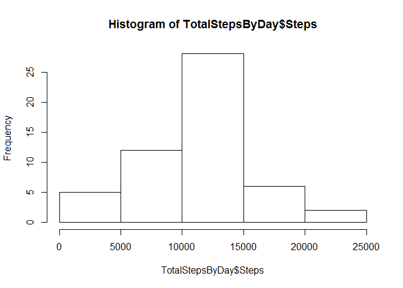
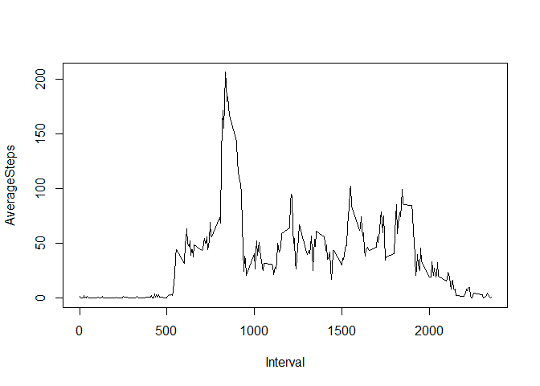
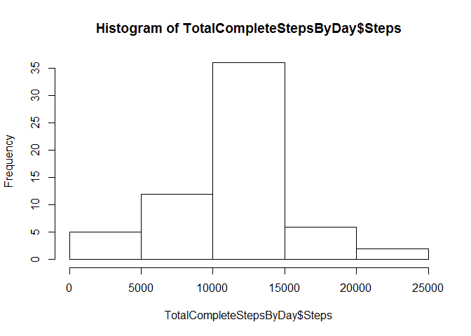
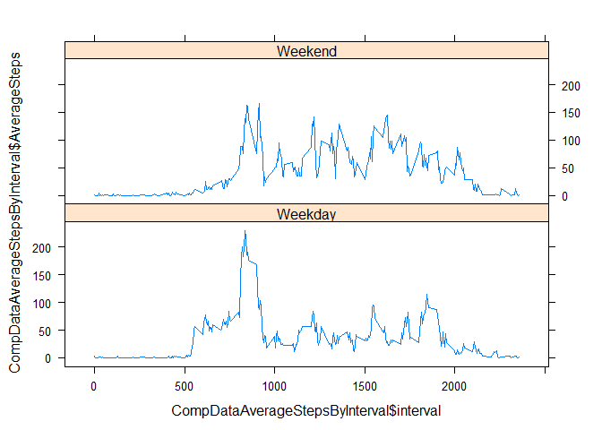

# CourseProject1-Reproducible Research
Chimi  
December 15, 2016  


1. Code for reading in the dataset and/or processing the data

```r
rawData <- read.csv("activity.csv")
#remove the NAs from dataset

NAinrawData <- is.na(rawData[,1]) 
cleanData <- rawData[!NAinrawData,]
NAData <- rawData[NAinrawData,]
```

2. Histogram of the total number of steps taken each day

```r
TotalStepsByDay <- aggregate(cleanData$steps,by = list(cleanData$date), FUN = sum)
names(TotalStepsByDay) = c("Date","Steps")
hist(TotalStepsByDay$Steps) # Displays the frequency of how many steps were taken 
```

<!-- -->

3. Mean and median number of steps taken each day

```r
AverageStepsByDay <- mean(TotalStepsByDay$Steps)
MedianStepsByDay <- median(TotalStepsByDay$Steps)
AverageStepsByDay
```

```
## [1] 10766.19
```

```r
MedianStepsByDay
```

```
## [1] 10765
```


4. Time series plot of the average number of steps taken

```r
## Plot Average Steps by Interval
AverageStepsByInterval <- aggregate(cleanData$steps, by = list(cleanData$interval), FUN=mean)
names(AverageStepsByInterval) = c("Interval", "AverageSteps")
plot(AverageStepsByInterval$Interval, AverageStepsByInterval$AverageSteps, type = "l", xlab = "Interval", ylab = "AverageSteps")
```

<!-- -->


5. The 5-minute interval that, on average, contains the maximum number of steps

```r
## Determine which Interval has the most average steps
MaxInterval <- AverageStepsByInterval[AverageStepsByInterval$AverageSteps == max(AverageStepsByInterval$AverageSteps),] 

MaxInterval
```

```
##     Interval AverageSteps
## 104      835     206.1698
```

6. Code to describe and show a strategy for imputing missing data

```r
# Substitute the Mean for mean from other days for each interval
substituteNA <- merge(NAData, AverageStepsByInterval, by.x = "interval", by.y = "Interval")
CompleteDataNoNA <- data.frame(substituteNA$interval,substituteNA$AverageSteps, substituteNA$date)
names(CompleteDataNoNA) <- c("interval","steps", "date")
CompleteDataNoNA <- rbind(CompleteDataNoNA,cleanData) # str has 17,568 observations - same as initial data set

#Calculate mean and Median
AverageStepsByDay <- mean(TotalStepsByDay$Steps)
MedianStepsByDay <- median(TotalStepsByDay$Steps)
AverageStepsByDay
```

```
## [1] 10766.19
```

```r
MedianStepsByDay
```

```
## [1] 10765
```
7. Histogram of the total number of steps taken each day after missing values are imputed

```r
# Make Histogram
TotalCompleteStepsByDay <- aggregate(CompleteDataNoNA$steps,by = list(CompleteDataNoNA$date), FUN = sum)
names(TotalCompleteStepsByDay) = c("Date","Steps")
hist(TotalCompleteStepsByDay$Steps) # Displays the frequency of how many steps were taken
```

<!-- -->

8. Panel plot comparing the average number of steps taken per 5-minute interval across weekdays and weekends

```r
Weekend <- c("Saturday","Sunday")
CompDataByDateWithDayDesignated <- cbind(CompleteDataNoNA,weekdays(as.Date(CompleteDataNoNA$date)) %in% Weekend)
names(CompDataByDateWithDayDesignated)[4] <- c("isWeekend")

library(plyr) # For function below, so summary can be done on more than one columns
CompDataAverageStepsByInterval <- ddply(CompDataByDateWithDayDesignated,.(interval, isWeekend),summarise,AverageSteps = mean(steps))
CompDataAverageStepsByInterval$Weekend <- ifelse(CompDataAverageStepsByInterval$isWeekend,"Weekend","Weekday")


library(lattice) #Make sure Lattice is installed
xyplot(CompDataAverageStepsByInterval$AverageSteps ~ CompDataAverageStepsByInterval$interval | CompDataAverageStepsByInterval$Weekend, layout = c(1,2), type = 'l')
```

<!-- -->


9. All of the R code needed to reproduce the results (numbers, plots, etc.) in the report


